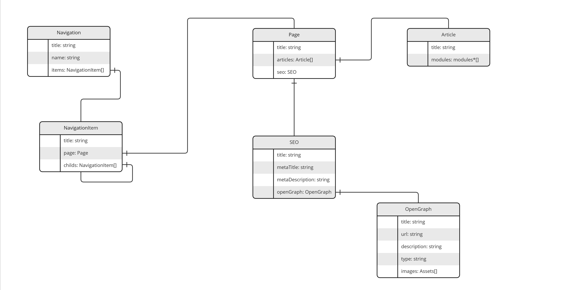

<h1 align="center">content-app/core</h1>

<p align="center"></p>

<p align="center"><strong>Build your website with contentful.</strong></p>

---

# Install 

`npm i @content-app/core`

# Model



# API

## createCoreModels(client: ClientAPI, options: Options)

This function creates the content types in your space.

```
import contentful from 'contentful-management';

(async () => { 
const client = contentful.createClient({
    accessToken: 'YOUR_ACCESS_TOKEN',
})

await createCoreModels(client, {
    spaceId: 'YOUR_SPACE_ID',
    environment: 'YOUR_ENVIRONMENT',
});
})();
```

# Modules 

There are 3 types of modules

- RouteModule: to extend routes
- PageModule: Load your own page content
- ContentModule: Load your own content 

# Content Modules

There are several ways to hook into the system. 
For example, you might want to implement a module that installs one or more content types, 
or you may want to add more pages, or you may want to add more data.
Even though there will be a page for every page contentype, there could be cases when you want to add your own. 

# Add your own content types 

If you want to use this feature you need to install the cli https://github.com/content-app/cli.

- First you need to install the module via npm. For example: `npm install module-content-stage`
- Then you can use the command `content-app load-content-module <contentModule>`. 
- This command will look after this file in the current path: `node_modules/@content-app/content-module_${contentModule}/install.js`
- The command will then import the exported function and call it with following arguments: client, space, environment

So your install.js might start like this. 

```js  
module.exports = async function({ client, space, environment }) {
     const myEntry = await environment.createContentTypeWithId({... your configs}, 'MyContentypeId');
     await myEntry.publish();
};
```

